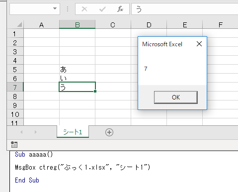
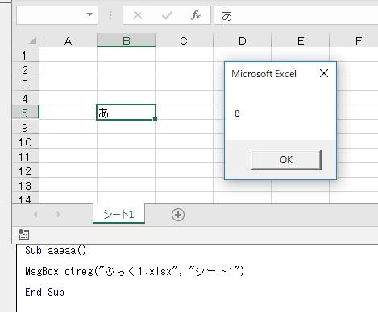

# ctreg
### 機能
表データの最終行を返す関数です。  
※最終行が非表示区間なら、その非表示区間の最終行を返します。

### 作成したきっかけ
表のデータを取り入れる際、隠し行含め、取りこぼしなく取り入れたいため。  
手作業だと、通常Ctrl+Endで最終行把握するが、隠し行に気付かなくヒューマンエラーとなる可能性がある。  
それを、プログラムで解決したいため。  

### 使用例
最終行が返されます。

※最終行が非表示区間の場合  
非表示区間の最終行が返されます。

